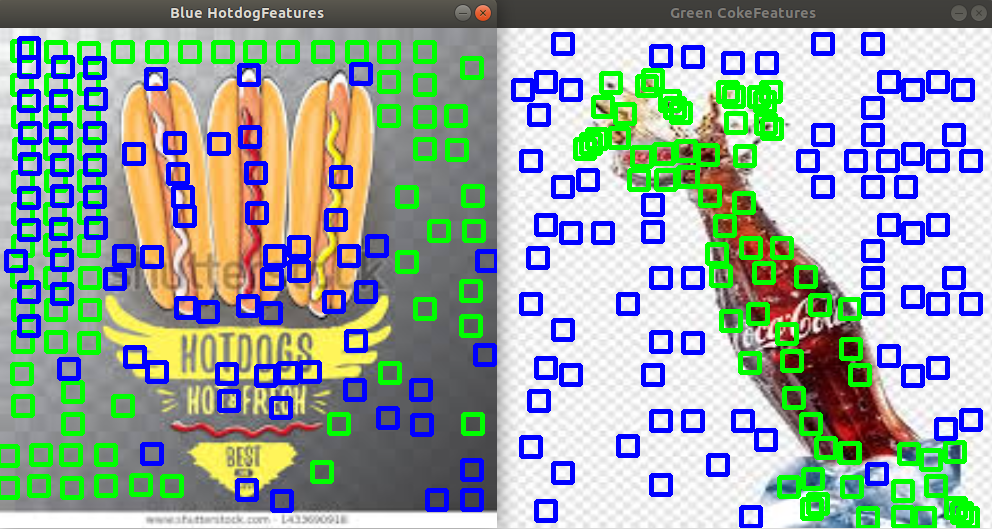

#HotDogNCoke



In this project, we demonstrate an HotDogNCoke detector that can detect if there is Coke and/orf HotDog in an Image.

We use sample data from google image search to create our labelled datasets of Coke and HotDog.
These samples are in `resources/train/hotdog` and `resources/train/coke`
Based on these templates, we use to apply a convolutional filter on test dataset.

# Build Instructions

```
rm -rf ~/capstone
mkdir -p ~/capstone/src
cd ~/capstone/src
git clone --single-branch --branch demo-ready https://github.com/shristipradhan/capstone.git
cd capstone
mkdir -p  build
cd build
cmake clean
cmake -D ..
make -j$(nproc)
./DisplayImage
```


