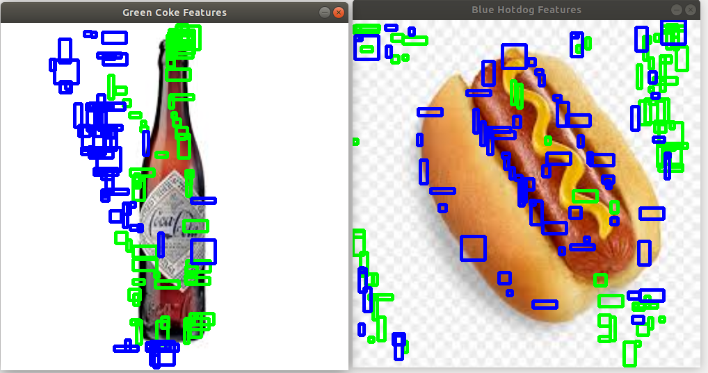
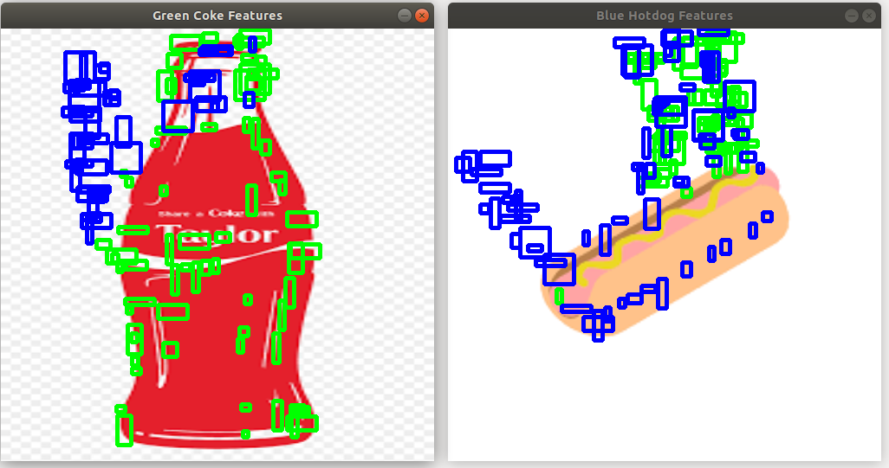
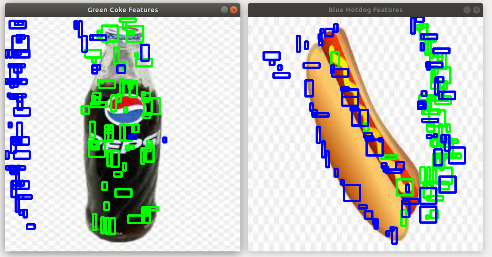
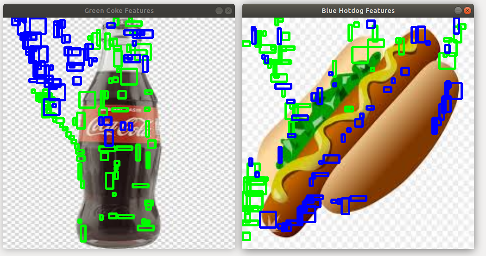

# HotDogNCoke


In this project, we describe a Naive Convolutional Filter (NCF)

We demonstrate use of NCF in an example HotDogNCoke detector project.

HotDocNCoke can detect if there is Coke and/or HotDog in an Image.

It's designed for applications like takeouts or item transfer.

We use sample data from google image search to create our labelled datasets of Coke and HotDog.

These samples are in `resources/train/hotdog` and `resources/train/coke`.

Based on these templates, we use a Naive Convolutional Filter (NCF) on a test dataset in `resources/test`.


# Build Instructions

`release` contains the latest up to date NCF implementation.

Instructions for a clean build from `release` branch of the repository is given below.


```
rm -rf ~/capstone
mkdir -p ~/capstone/src
cd ~/capstone/src
git clone --single-branch --branch release https://github.com/shristipradhan/capstone.git
cd capstone
mkdir -p  ../build
cd ../build
cmake ../capstone
make -j$(nproc)
./DisplayImage

```



# Requirements

This project requires `opencv` ,	`opencv_contrib` and `opencv_extra` packages. This project was built on stable release `4.3.0`. So, please note to use the release.

```
mkdir -p ~/opencv_ws/src
cd ~/opencv_ws/src
git clone --branch 4.3.0 https://github.com/opencv/opencv.git
git clone --branch 4.3.0 https://github.com/opencv/opencv_contrib.git
git clone --branch 4.3.0 https://github.com/opencv/opencv_extra.git
cd opencv
mkdir build
cd build
cmake -D CMAKE_BUILD_TYPE=Release -D CMAKE_INSTALL_PREFIX=/usr/local -D OPENCV_EXTRA_MODULES_PATH=../../opencv_contrib/modules/  BUILD_DOCS BUILD_EXAMPLES OPENCV_ENABLE_NONFREE ..
make -j$(nproc)
sudo make install
```


# Handy Scripts

There are handy scripts to help automate setup of opencv and this package in `scripts/install.sh` and `scripts/setup_opencv.sh`

# Screenshots





# License

Use as is! BSD whereever applicable.


